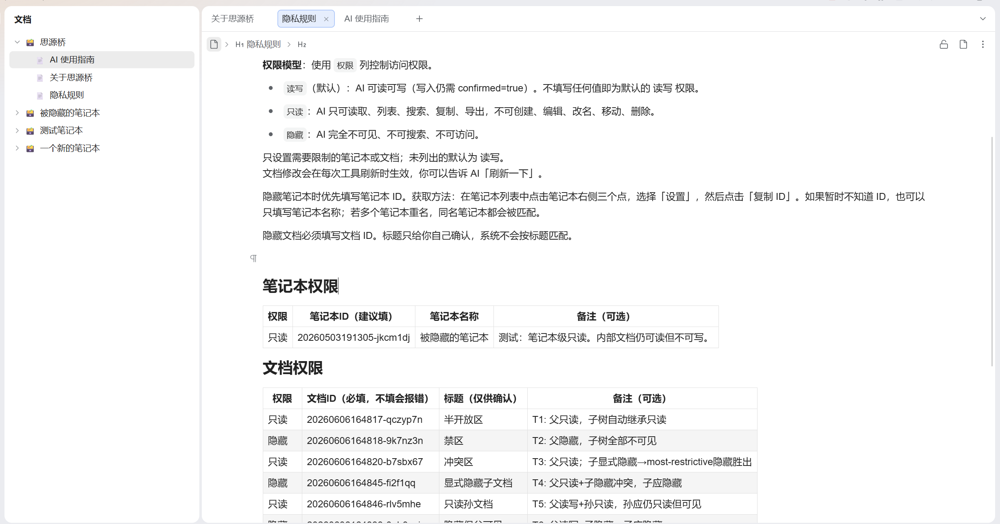
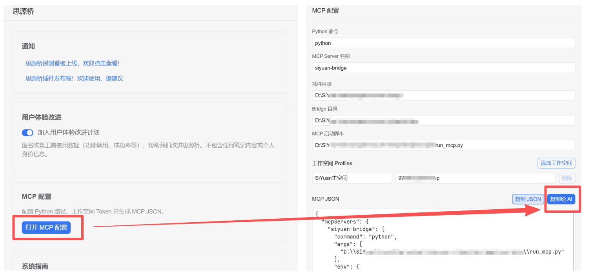
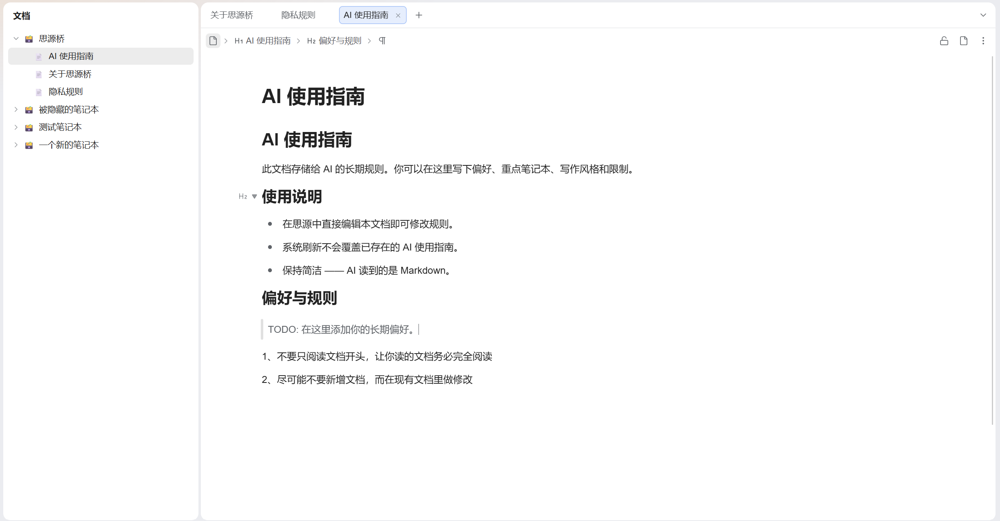
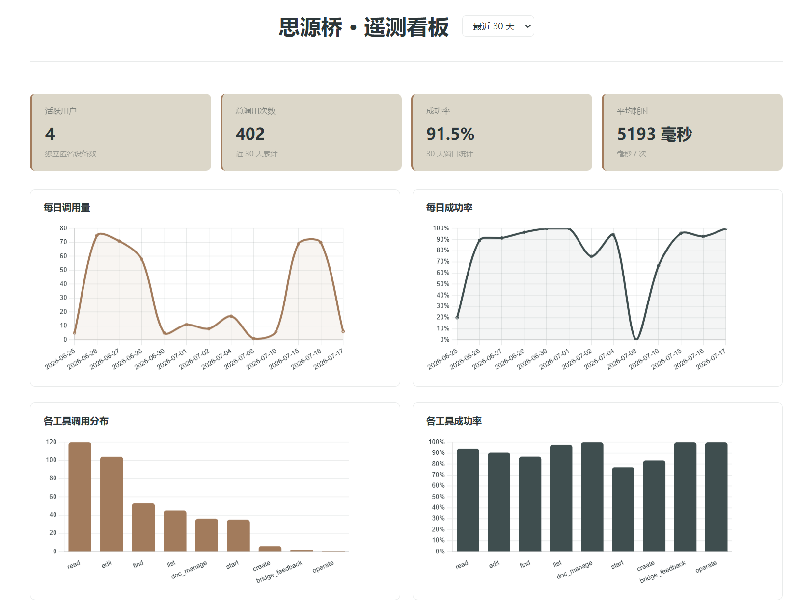

# Siyuan Bridge: Connect SiYuan Notes to Your AI Assistant

Let AI safely read, search, and edit your SiYuan notes.

After installing Siyuan Bridge, you can work with your knowledge base directly inside AI agents like Codex, Claude Code, Hermes, and WorkBuddy. Just tell the AI what to find, read, or modify — Siyuan Bridge handles document navigation, long-text reading, block structure, and write verification.

It focuses on documents and knowledge bases: writing, organizing, editing tables, managing document trees, and handling cross-document references. Databases, flashcards, and block styling are not currently supported.

## What You Can Ask AI to Do

- "Find my notes on procrastination and attention, identify recurring ideas, and write a summary with inline citations from the original notes."
- "Organize my course notes into a review framework with source references."
- "Section 3 of this article is confusing — keep the meaning but reorder the paragraphs."
- "Update the dates in my travel itinerary and add a budget column."
- "Insert the photos and itinerary files on my computer into this travel journal."
- "Import a local Markdown file as a new note, or insert part of it into an existing note."
- "Create a new project notebook and organize these PDFs into categorized documents."

AI can search the entire knowledge base by keyword and browse notebook and document trees. For long documents, it sees the outline first, then reads in complete paragraphs — never splitting mid-sentence. When editing, it can rewrite single paragraphs, reorganize multiple paragraphs, insert before or after, delete ranges, and append. You can turn on “Show Siyuan Bridge block numbers” in the plugin settings so the numbers beside blocks match what AI calls “block N”; numbers refresh after structural edits, and AI re-reads before using them again.

Tables support cell-level editing by row and column, including adding or removing rows and columns. Images and files can be uploaded to SiYuan assets; local folders are inserted as links. Local Markdown files can be imported directly as new documents, or their content inserted at a specific position in an existing document. Local image, file, and folder references in the Markdown are imported as SiYuan assets; network URLs are left unchanged. AI can also create notebooks and documents, and rename, move, copy, export, or delete existing ones.

SiYuan block references are fully supported. You can check what references a document or its blocks. When AI modifies or deletes content, Siyuan Bridge verifies whether any existing references would break.

## How Siyuan Bridge Protects Your Notes

AI is fast, but a single mistake can affect a lot of content. Siyuan Bridge integrates confirmation, snapshots, reference detection, and privacy rules into the actual workflow.

Before creating, editing, moving, copying, or deleting content, explicit user approval is required. Before writing, Siyuan Bridge creates a workspace snapshot. If results aren't what you expected, you can manually restore from SiYuan's data history. Siyuan Bridge does not auto-rollback, avoiding overwrites of subsequent valid changes.

When deleting documents, overwriting content, or merging paragraphs, existing document IDs and block IDs may disappear. If other notes still reference them, Siyuan Bridge halts the operation by default and lists the visible reference sources. The AI can only proceed after you've reviewed the impact and explicitly allowed it. You can also proactively check references at any time, not just when something is about to break.

Privacy rules are maintained directly in SiYuan. Notebooks or documents can be set to read-write, read-only, or hidden, with permissions inherited down the document tree. Hidden content will not appear in listings, search, reading, or operations. Read-only content can be queried and organized but not modified. The privacy rules document itself is isolated from AI — it cannot be read or modified by AI.

Closed notebooks mean "not currently in use," not "hidden." During search and reading, Siyuan Bridge temporarily opens closed notebooks as needed and restores them afterward. If you want to prevent AI from accessing certain content, set it as hidden in the privacy rules.

## Installation and Getting Started

You need the desktop version of SiYuan Notes and Python 3.11+.

1. Install the plugin from the SiYuan Bazaar (search for "Siyuan Bridge").
2. Open plugin settings and save your workspace token on the MCP configuration page.
3. Copy the generated MCP config and send it to your AI agent. Let it register using your platform's format.
4. Restart your AI agent, then say: "Help me find something about [topic] in my notes."

If you use SiYuan on multiple computers with different directory paths, open the plugin settings on each computer and copy the machine-specific config.

When the plugin is first enabled, Siyuan Bridge creates a notebook named "Siyuan Bridge" in the current workspace. It stores user preferences, the workspace index, usage guides, and privacy rules. Installation and updates maintain it automatically when the plugin reloads; opening settings or calling an AI tool first is not required. All documents can be viewed and edited like any other SiYuan document.

In "User Preferences," you can tell AI how concise answers should be, when to ask for confirmation before writing, which notebooks are more important, and what conventions to follow when organizing content. These preferences live in SiYuan and sync with your workspace.

## Currently Not Supported

- Mobile: Siyuan Bridge runs as a local Python program, currently desktop only.
- Database editing: databases can be read as regular tables, editing not yet supported.
- Flashcards, tags, and block styling features.
- Deleting entire notebooks: currently you can create notebooks; deletion is only for documents and their children.

## FAQ

- **Does it support multiple workspaces?** Yes. Install the plugin in your primary workspace, then manually add tokens for other workspaces in plugin settings. User preferences, workspace index, and privacy rules are stored per workspace and switch automatically. Only one workspace can run at a time. To switch: 1) open the target workspace, 2) close other workspaces, 3) close the target workspace, 4) restart SiYuan. This 4-step process is needed because the first workspace uses a fixed port while subsequent ones use random ports that the tool can't reliably detect. Do not register the same MCP in every workspace — AI would see duplicate tools.

- **"SiYuan not running" error?** Open the SiYuan desktop app and verify the correct workspace. MCP registration succeeds even when SiYuan is offline; tools will clearly prompt you to start SiYuan when actually needed. If SiYuan is already running and errors persist, restart your AI agent. Some agents lose MCP connections after network proxy or VPN changes.

- **AI can't see tools after configuration?** Verify the MCP config was copied to the correct client and the client was restarted. MCP registration formats vary slightly across platforms; the plugin currently generates Claude Code format. You can also give the config to your AI and ask it to convert for your platform.

- **Using SiYuan on two computers?** The plugin syncs with your workspace, but the MCP launch script must use absolute paths for each machine. Open plugin settings on each computer and copy the machine-specific config.

- **What's the telemetry program?** The experience improvement program anonymously collects tool success rates to identify usability issues. It's off by default. When enabled, it only records version, tool name, duration, success/failure, and error type — no note content, search queries, or conversation data is uploaded. Anonymous stats are available on the [public dashboard](https://zingerplayground.top/code/siyuan-bridge-telemetry/).

  

- **Content disappears, conflicts, or crashes after editing?** This is typically caused by two computers running the same workspace with auto-sync enabled. Set sync to manual, or sync only on startup and shutdown. You can also ask AI to trigger a sync after completing edits.

- **No snapshot created before edit/write?** Auto-sync also creates snapshots. During sync, SiYuan may consider data unchanged and skip Siyuan Bridge's snapshot request. Set sync to manual, or sync only on startup and shutdown.

- **Will snapshots keep growing?** SiYuan has built-in snapshot cleanup (typically keeps 2 per day, deletes after 180 days), but this requires cloud sync. For local-only workspaces without sync, periodically clean up manually via Settings → Data Repository → Cleanup.

- **What can Siyuan Bridge do with documents?** Create notebooks and documents. Rename, copy, and export only affect the current document. Move and delete affect the entire document subtree (the document and all its children). Deleting entire notebooks is not currently supported.

- **How to check what references a document?** Tell AI: "Check references for this document." Siyuan Bridge checks the document and all its blocks, summarizing by reference source and showing visible reference content. References from hidden documents are counted but not revealed.

- **Will delete or overwrite break block references?** Any operation that would make existing document or block IDs disappear first checks for references. When references exist, Siyuan Bridge defaults to rejecting the operation and shows visible reference sources. The AI can only proceed after you've reviewed the impact and explicitly allowed it.

## Feedback and Community

Run into issues or have ideas? Tell your AI "submit feedback," or head to [GitHub](https://github.com/alone-tree/siyuan-bridge) to open an issue.

Community discussion: [Chain Drops (链滴)](https://ld246.com/article/1785319302029)

If Siyuan Bridge helps you, donations are appreciated!

---

Apache-2.0 License
