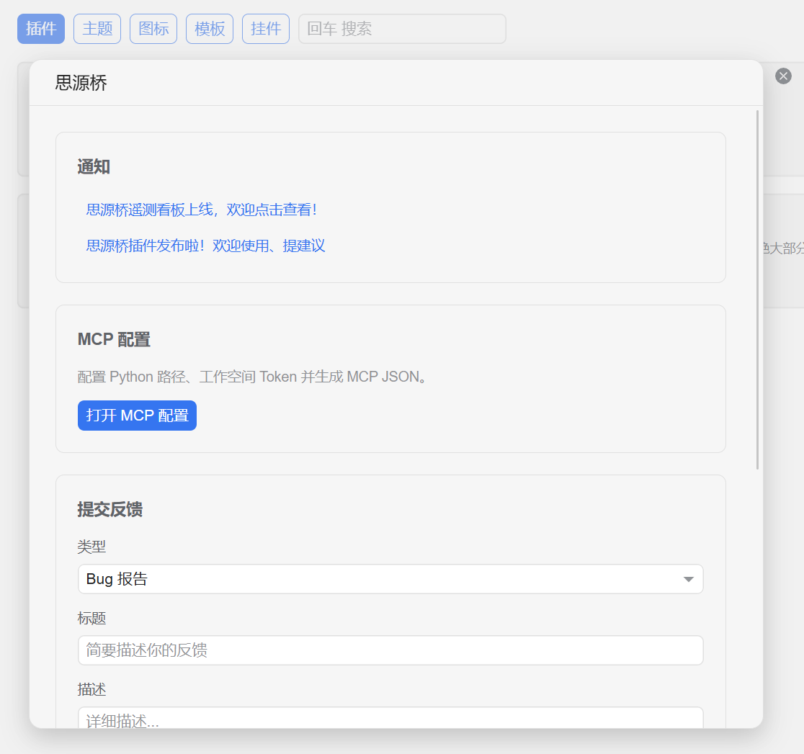
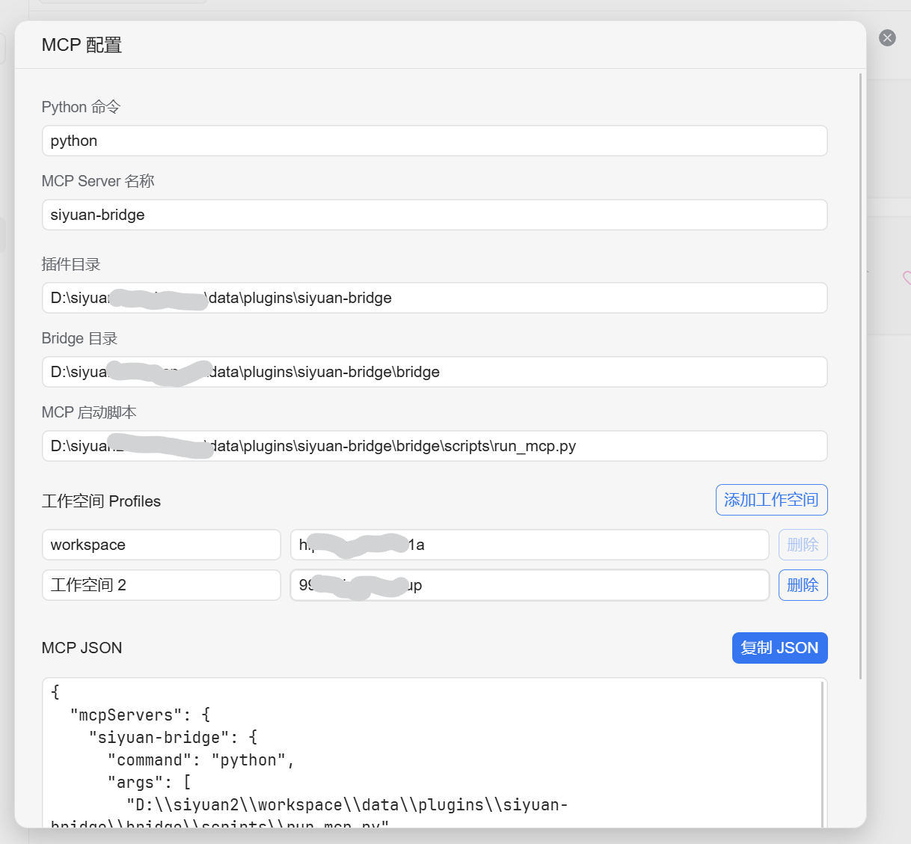

# SiYuan Bridge

Give your AI agent safe access to read, search, and edit your SiYuan notes.

---

## Highlights

### Efficient: Built Around the AI Coding Workflow

The core tools follow the same mental model as AI coding tools while preserving SiYuan's block-based structure.

| Tool | What it does | Analogy |
| --- | --- | --- |
| `siyuan_start` | Loads the note index and user preferences | `CLAUDE.md` |
| `siyuan_operate` | Refreshes the local index and triggers SiYuan's built-in sync | Operations |
| `siyuan_list` | Lists notebooks and document trees | `ls` |
| `siyuan_find` | Searches the knowledge base | `grep` |
| `siyuan_read` | Reads in sections with outline navigation and block ID references | `read` |
| `siyuan_edit` | Edits blocks and tables, and inserts local assets | `edit` |
| `siyuan_create` | Creates or rewrites documents | `write` |
| `siyuan_doc_manage` | Creates notebooks; renames, moves, deletes, copies, and exports documents | File manager |

Each tool wraps the underlying operations needed to make precise changes with fewer opportunities for error. Working with notes feels as natural as editing documents or code while still respecting SiYuan's block model.

To create a notebook, use `siyuan_doc_manage(action="create_notebook", notebook_name="New Notebook", confirmed=true)`, then create a document with `siyuan_create(path="/New Notebook/New Document", ...)`. A missing notebook is never created implicitly.

`siyuan_operate(action="sync")` works like clicking SiYuan's sync button. It waits up to 10 seconds by default; slower syncs can set `timeout_seconds` up to 120 seconds.

This is not a kitchen-sink MCP server. It focuses on making the most common tools work well.

### Human in the Loop

Privacy rules, user preferences, and tool guides live directly inside SiYuan, so there are no separate configuration files to hunt down:

- **Privacy Rules**: Edit the rules document in SiYuan, then ask the AI to refresh. The AI cannot read or modify the rules themselves. Note that **a closed notebook is not hidden from the AI**. SiYuan Bridge temporarily opens closed notebooks for search and reading, then restores their previous state. To block access, mark a notebook as hidden or read-only in Privacy Rules.
- **User Preferences**: Store your preferences and instructions for AI directly in SiYuan. The old AI Guide is renamed during upgrade while preserving its document ID and body.
- **MCP Usage Guide and Workspace Index Guide**: Ordinary SiYuan documents that you may customize. Plugin settings can reset either guide to the latest default while preserving its document ID.
- **Workspace Index**: Let the AI build a navigational index of your notebooks, then review, edit, and annotate it so the AI can find information more accurately.

You remain in control.

Privacy Rules provide notebook- and document-level access control with read-write, read-only, and hidden permissions. The AI cannot read or modify the rules themselves.

User Preferences stores your long-term preferences and instructions. Edit it directly in SiYuan and the changes take effect immediately.

### Stable and Hassle-Free

- **MCP registration is independent of SiYuan**: The MCP server can register whether SiYuan is running or not. You can close SiYuan at any time and reopen it when needed without breaking registration or leaving tools hanging.
- **Zero dependencies**: The bridge uses only the Python standard library. Python 3.11 or later is all you need.
- **One-step configuration**: The plugin reads the workspace token and generates MCP JSON. Copy it to your AI agent and ask the agent to install it.
- **Permission inheritance**: Privacy permissions cascade down the document tree. A read-only parent makes its children read-only; a hidden parent hides the entire subtree. Deleting a child also checks its ancestors, so a child under a read-only parent cannot be deleted. The AI can copy read-only material to a writable location before editing, or you can temporarily grant read-write access in Privacy Rules and restore it afterward.
- **Closed notebooks remain searchable**: A closed notebook may contain valuable knowledge even if you do not use it often. SiYuan Bridge temporarily opens it for search and reading, then closes it again. Use hidden or read-only permissions when you want to restrict AI access.

### Transparent, Optional Usage Analytics

Usage analytics are off by default. When enabled, they record only the version, tool name, duration, and whether a call succeeded. Note content and conversations are never uploaded. [Anonymous aggregate statistics are public](https://zingerplayground.top/code/siyuan-bridge-telemetry/).

## Use Cases

**Let AI organize your knowledge base**: After reading your notes, the AI can rewrite documents, add tags, and reorganize the document tree—much like refactoring code.

**Synthesize information across documents**: The AI can read several related notes, produce a combined answer, and cite the relevant block indexes instead of returning only document titles.

## Installation

1. Search for “SiYuan Bridge” in the SiYuan marketplace and install the plugin.
2. Save your workspace token in the plugin settings.
3. Copy the generated MCP JSON into your AI client.
4. Restart the AI client and ask it to “search my notes for XXX.”

**Requirements**: Python 3.11+ and SiYuan.

The plugin home page provides a single place for notifications, MCP configuration, and feedback.

Confirm the Python and workspace settings on the MCP configuration page, then copy the generated MCP JSON. The generated configuration uses Claude Code's format. For another AI agent, you can say:

> Configure this MCP server using the native syntax required by OpenClaw, Hermes, Codex, WorkBuddy, or the AI agent platform I am using.

## Not Yet Supported

- **Mobile** — The bridge runs as a local Python process and does not support mobile devices.
- **SiYuan databases** — Databases are rendered as read-only tables; editing is not yet supported.
- **Flashcards, tags, and block styling** — These are outside the core knowledge-base editing workflow and may be added when needed.

## FAQ

- **Does it support multiple SiYuan workspaces?** Yes. Install the plugin in your primary workspace, then add tokens for other workspaces in the plugin settings. Privacy Rules, User Preferences, and the Workspace Index live inside each workspace and follow it automatically. Only one workspace can be active at a time. To switch: 1) open the target workspace, 2) close the other workspaces, 3) close the target workspace, and 4) open SiYuan again. This is necessary because the first workspace uses SiYuan's fixed port while later workspaces use random ports that are difficult to detect. Do not install and register the plugin separately in every workspace, or the AI will see duplicate MCP tools.
- **Why does it say SiYuan is not running?** Open the SiYuan desktop app and confirm that the correct workspace is active. If SiYuan is already running, restart the AI agent; the problem may come from the agent or a network proxy. Claude Code is known to occasionally lose MCP tools when network conditions change, such as opening it with a VPN enabled and then disabling the VPN.
- **Why can't the AI see the tools after setup?** Confirm that you copied the MCP JSON into the correct client using that platform's native format, then restart the client. MCP registration syntax differs slightly between AI agents. The plugin currently generates Claude Code format, but you can ask your AI agent to translate it into the required format.
- **Why does the MCP path still point to my other computer?** The plugin itself can sync through SiYuan, but the launcher path in MCP JSON must be absolute and local to the current computer. Open the plugin's MCP settings separately on each computer; the page regenerates the path from the active local workspace before you copy it into that computer's AI client.
- **Does it upload my notes?** No. The optional usage analytics record only version information, tool names, duration, success or failure, and error types. This helps identify frequently used features that need improvement. Note content and conversations are never uploaded, and analytics are off by default.
- **Why did content disappear, conflict, or crash after an edit?** This can happen when the same workspace is open on two computers with automatic cloud sync enabled. Switch to manual sync so SiYuan syncs only at startup and shutdown. You can also ask the AI to trigger a manual sync after each edit.
- **Why wasn't a snapshot created before an edit?** Automatic cloud sync can create snapshots itself, causing the pre-edit snapshot check to report “no changes” and skip the snapshot. Switch to manual sync so SiYuan syncs only at startup and shutdown.
- **Will snapshots keep accumulating?** SiYuan automatically keeps two snapshots per day and removes them after 180 days, but cleanup runs only when cloud sync is enabled. For a local workspace without cloud sync, periodically use Settings → Data Repository → Purge. Automated snapshot cleanup is planned.
- **What can `siyuan_doc_manage` do?** It can explicitly create a notebook and manage document trees. Rename, copy, and export affect one document. Move and delete affect the entire document subtree, including all child documents. Deleting an entire notebook is not currently exposed.

## Community and Feedback

- Community post: [LD246](https://ld246.com/article/1777909344378)
- Found a bug or have an idea? Open an [issue or pull request on GitHub](https://github.com/alone-tree/siyuan-bridge), or ask the AI to “submit feedback” using the built-in feedback tool.
- Visit the [public dashboard](https://zingerplayground.top/code/siyuan-bridge-telemetry/) to see how the MCP tools are being used.

If SiYuan Bridge helps you, consider giving the project a Star or supporting its development.

---

## License

Apache-2.0
