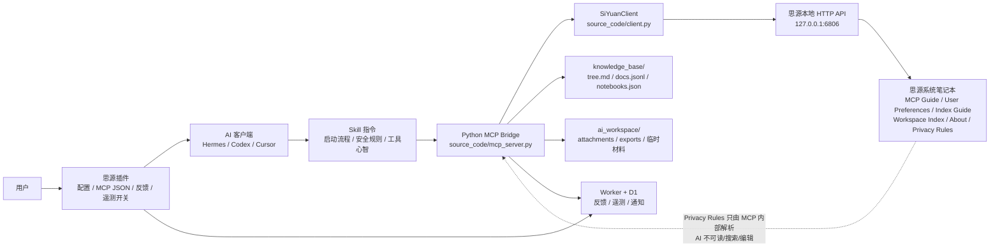

# SiYuan Bridge 架构文档

> 当前事实基准：2026-06-14，MCP server 版本 `1.0.0`，实际暴露 9 个 MCP 工具。
> 人类可读架构图见 `docs/architecture-map.html`。如果整体架构、工具关系、主要数据流或产品边界发生较大变化，必须同步更新本 Markdown 和该 HTML。

## 整体架构

思源桥的核心是一个本地 Python MCP Bridge。思源插件是安装和配置入口，外部 AI 客户端通过 MCP 调用 Python Bridge，Python Bridge 再调用思源本地 HTTP API。用户的长期规则放在思源系统笔记本，本地 `knowledge_base/` 只保存可重建的安全索引。



核心分层：

| 层 | 职责 | 主要文件 |
|---|---|---|
| 思源插件壳 | 降低安装门槛，写入本地配置，生成 MCP JSON，提供反馈和遥测开关 | `siyuan-plugin/`、`docs/FRONTEND.md` |
| AI 使用层 | 告诉外部 Agent 如何启动、搜索、阅读、编辑、避开隐私边界 | `plugins/siyuan-bridge/skills/` |
| MCP 工具层 | 暴露 9 个高层工具，执行权限、快照、路径同步、遥测包装 | `source_code/mcp_server.py` |
| 思源 API 封装 | 封装项目需要的思源 HTTP API，不做完整 SDK | `source_code/client.py`、`docs/思源API.md` |
| 索引与隐私层 | 生成可见索引，解析 Privacy Rules，过滤 list/search/read/write | `source_code/indexer.py`、`source_code/ignore.py` |
| 系统笔记本层 | 维护六篇固定系统文档、兼容迁移、模板版本和本地 ID 注册表 | `source_code/agent_notebook.py`、`source_code/system_state.py`、`source_code/system_templates.py`、`source_code/i18n.py` |
| 反馈与遥测层 | 可选记录工具调用元数据，提交反馈，不收集笔记内容 | `source_code/telemetry.py`、`worker/` |

核心调用关系：

| 场景 | 主调用链 |
|---|---|
| 首次使用 | 思源插件读取当前工作空间 Token → 写入 `bridge/config.local.json` → 用户复制 MCP JSON 到 AI 客户端 |
| 会话启动 | AI 调 `siyuan_start` → 探测 profile → 确保系统笔记本 → 解析 Privacy Rules → 刷新安全索引 → 返回启动包 |
| 搜索 | `siyuan_find` → 临时打开目标笔记本 → 思源搜索/SQL → 隐私过滤 → 按文档聚合结果 |
| 阅读 | `siyuan_read` → 解析可见文档 → 路径 live 校验 → `getChildBlocks` → 块窗口 + 大纲 → 提取附件到 `ai_workspace/` |
| 写入 | `siyuan_create/edit/doc_manage` → `confirmed=true` + 权限检查 → 创建快照 → 写思源 → 路径同步 → 安全刷新索引 |
| 语义索引 | `siyuan-index-builder` Skill → list/read 关键文档 → 经用户确认写入系统笔记本的 Workspace Index |

## 项目定位

思源桥（SiYuan Bridge）是一个本地 Python MCP 适配层，让外部 AI agent 安全读取、搜索和维护用户的思源笔记。它不是思源插件，也不是通用思源 API SDK；产品界面是 MCP 工具和 Skill，CLI 只作为开发诊断入口。

核心目标：

- 把思源笔记变成 AI agent 可导航、可引用、可局部编辑的结构化个人知识库。
- 用少量高层工具封装思源底层 API，避免 AI 在几十个陌生 API 之间做错误选择。
- 让用户在思源 UI 内维护长期偏好、语义索引和隐私规则，而不是要求用户直接改本地配置文件。
- 兼具思源笔记的块和ID设计，并尽可能让工具符合AI的文档操作心智。

当前工具心智模型参考 AI 编程工具：

| 编程工具心智    | 思源桥工具            | 说明                             |
| --------------- | --------------------- | -------------------------------- |
| `ls`          | `siyuan_list`       | 列出可见笔记本或某路径下一层文档 |
| `grep`        | `siyuan_find`       | 搜索可见知识库                   |
| `read`        | `siyuan_read`       | 按块窗口阅读文档                 |
| `write`       | `siyuan_create`     | 创建或重写文档                   |
| `edit`        | `siyuan_edit`       | 基于块坐标编辑文档正文           |
| `file_manage` | `siyuan_doc_manage` | 改名、移动、删除、复制、导出文档 |

项目优先使用可读路径而非ID进行定位，但必要时保留ID操作方式。

## 产品边界

当前用户功能只通过 MCP 工具和 Skill 暴露。CLI 命令如 `python -m source_code doctor`、`refresh`、`read` 主要服务开发者诊断，不应成为普通 AI 工作流的主入口。

不做的事情：

- 不自动启动思源。连接失败时只提示用户手动打开思源。
- 不把思源 API 原样逐个暴露给 AI。
- 不让 AI 读取、搜索、编辑 Privacy Rules 文档。
- 不提供 AI 自动 `checkoutRepo` 或工作空间回滚工具。
- 不把系统笔记本内容当作用户原始知识资料。
- 不直接管理思源账号、同步、设置、插件、集市等应用级状态。

## 代码结构

```text
source_code/
  client.py          思源 HTTP API 封装
  config.py          config.local.json / 环境变量 / profile 探测
  telemetry.py       遥测与反馈：事件收集、本地存储、代理上传、反馈提交
  ignore.py          Privacy Rules Markdown 表格解析与权限判断
  indexer.py         刷新本地安全索引与工作区 README
  i18n.py            系统笔记本和系统文档名称、模板、多语言
  agent_notebook.py  系统笔记本服务层
  mcp_server.py      MCP stdio server、工具实现、工具 schema
  cli.py             开发诊断 CLI

plugins/siyuan-bridge/
  scripts/run_mcp.py
  skills/siyuan-bridge/SKILL.md
  skills/siyuan-index-builder/SKILL.md

knowledge_base/      运行时缓存，Git 忽略
ai_workspace/        AI 工作区，Git 忽略
docs/                设计、开发和工程记录
tests/               单元测试
```

`mcp_server.py` 当前承担过多职责：协议处理、工具 schema、文档定位、搜索富化、块展示、表格编辑、附件提取、写入操作都在同一文件中。后续会重构拆分，但重构必须保持 MCP 工具契约不变。

当前 Python 代码只依赖标准库，没有 `requirements.txt`、`pyproject.toml` 或第三方运行时依赖。这一点影响发布形态：ZIP 和未来思源插件包可以直接携带 Python 源码，第一版只要求用户本机有可用 Python，不需要插件安装阶段创建虚拟环境或执行 `pip install`。

## 思源插件形态

思源插件形态是新的低安装门槛入口，不替代 Python MCP Bridge 的核心实现。第一版插件职责：

- 提供设置页。
- 写入插件内 `bridge/config.local.json`。
- 写入插件内 `bridge/telemetry.json`。
- 生成可复制 MCP JSON。
- 携带由同步脚本复制的 Python Bridge 运行文件。
- 提供通知、反馈和用户体验改进开关的前端入口。

插件内运行目录：

```text
siyuan-plugin/
  plugin.json
  index.js
  index.css
  bridge/
    source_code/
    scripts/run_mcp.py
    skills/
```

`siyuan-plugin/bridge/` 由 `python scripts/sync_siyuan_plugin_bridge.py` 生成，不提交 Git。同步脚本只复制必要 Python 运行文件和说明文件，不复制 `config.local.json`、`knowledge_base/`、`ai_workspace/`、`tests/`、`.mcp.json` 或 `dist/`。

MCP JSON 只包含 Python 命令、`run_mcp.py` 绝对路径和 `PYTHONUTF8=1`。Token 只保存在 `bridge/config.local.json` 中，并继续使用现有 `profiles` 配置模型。绝对路径属于当前设备运行状态，不写入插件配置；插件每次打开 MCP 配置页或点击“刷新 JSON”时，都会通过 `/api/system/getWorkspaces` 重新识别当前打开的本机工作空间并生成路径。

插件启动和设置页通过思源本地 `/api/system/getConf` 获取当前工作空间 Token，通过 `/api/system/getWorkspaces` 获取当前设备实际打开的工作空间路径。首次启用插件时，如果 `bridge/config.local.json` 不存在，或默认 profile 没有 Token，插件会自动写入当前工作空间名称和 Token，让外部 MCP 客户端不需要先手动打开设置页并保存。Token 在设置页中允许明文显示，方便用户确认工作空间；但不得写入 MCP JSON。若用户已有非空本地 profile Token，插件不自动覆盖。用户手动新增、改名或修改 Token 后，仍通过设置页“保存配置”更新 `bridge/config.local.json`。多台电脑同步同一插件时，profiles 等插件配置可以同步，但 MCP 绝对路径必须在每台电脑上按当前工作空间重新生成。

插件前端的实现细节、CommonJS/ESM 加载坑、测试导入流程和 UI 数据流见 `docs/FRONTEND.md`。架构文档只记录它与 Python Bridge、配置文件和 Worker 后端的关系。

## 配置与工作空间连接

配置入口：

- `config.local.json`：本地 token 配置，Git 忽略。
- `SIYUAN_TOKEN`：环境变量 token，优先级高于配置文件。
- `SIYUAN_AGENT_LANGUAGE`：语言环境变量。

配置模型：

```json
{
  "profiles": [
    {
      "name": "主工作空间",
      "token": "<token>"
    }
  ],
  "language": "zh-CN"
}
```

思源默认监听 `http://127.0.0.1:6806` 和 `http://localhost:6806`。`detect_active_profile()` 会用各 profile token 调用 `list_notebooks()` 探测当前在线工作空间。思源一次只有一个工作空间稳定暴露在默认端口；多工作空间场景下，系统笔记本和隐私规则存放在思源内，天然随当前工作空间切换。

连接失败的行为要求：

- MCP 工具调用前探测思源 API。
- 不尝试查找或启动思源进程。
- 错误提示必须包含“请提示用户手动打开思源笔记后重试。”

## 系统笔记本

系统笔记本是工作空间级配置和导航层。当前名称：

- 中文：`思源桥`
- 英文：`SiYuan Bridge`
- 向后兼容（来自项目早期名称 SiYuan Agent Bridge）：`思源代理桥`、`SiYuan Agent Bridge`

系统笔记本文档：

| 文档 key | 中文名 | 英文名 | 生命周期 |
|---|---|---|---|
| `mcp_usage_guide` | `MCP 使用指南` | `MCP Usage Guide` | 插件模板创建；用户可改；未修改时随版本升级；设置页可重置 |
| `workspace_index_guide` | `工作空间索引创建指南` | `Workspace Index Guide` | 由现有索引构建 Skill 转为普通文档模板；生命周期同上 |
| `ai_guide` | `用户个性化要求` | `User Preferences` | 沿用内部 key；旧 `AI 使用指南` / `AI Guide` 按原 ID 更名；正文不覆盖 |
| `workspace_index` | `工作空间索引` | `Workspace Index` | 缺失时创建一句占位提示；之后不自动覆盖 |
| `about` | `关于思源桥` | `About SiYuan Bridge` | 开发者控制；按 JSON 文档 ID 定位；标题或正文被修改时恢复标准标题并按原 ID 覆盖 |
| `privacy_rules` | `隐私规则` | `Privacy Rules` | 不存在时创建；存在后不覆盖；只供 MCP 内部解析 |

启动时数据流：

1. `siyuan_start` 调用 `ensure_agent_notebook()`。
2. 查找或创建系统笔记本。
3. 用 `knowledge_base/system_state.json` 中当前工作空间的文档 ID 优先定位六篇固定文档；JSON 尚未建立或 ID 失效时回退到当前名称和历史名称。
4. 迁移旧 AI Guide：按原文档 ID 更名为 User Preferences；用户正文保留。新旧名称同时存在时使用新名称，旧文档保留但忽略。
5. 创建或更新两篇可重置指南和 About；创建缺失的 User Preferences、Workspace Index 占位文档和 Privacy Rules。
6. 解析 Privacy Rules，写入 `knowledge_base/privacy_rules.json` 缓存。
7. 刷新安全索引并组装启动包。
8. 成功后原子更新 `knowledge_base/system_state.json`。

系统笔记本设计原则：

- 系统笔记本进入正常安全索引，可以像普通笔记本一样 list/find/read/write；普通 Privacy Rules 对它正常生效。
- User Preferences 是用户写给 AI 的要求，Workspace Index 是导航；About 和两篇指南是工具说明。
- Privacy Rules 只能由 MCP server 内部读取解析，AI 不可见。

- Privacy Rules 的硬隔离使用系统笔记本 ID 和 Privacy Rules 文档 ID；其他笔记本下同名普通文档不受硬隔离。

系统身份只记录在本地 JSON，不写思源自定义属性。JSON 以实时确认存在的系统笔记本 ID 作为工作空间键，不保存工作空间路径和 Token。它是本地缓存而非权威数据：每次启动实时校验 ID，失效后按名称恢复并重写。

两篇可重置指南的模板位于 `templates/system-docs/`。JSON 记录文档 ID、模板版本、源文件 SHA-256、导入思源后实际 Markdown 的 SHA-256 和用户修改状态。升级时只有当前正文仍等于上次记录的实际正文，才允许自动更新；检测到用户修改后永久保留，直到用户在设置页重置。

## 本地缓存与运行时文件

本地缓存位于 `knowledge_base/`：

| 文件                   | 来源                     | 用途                             |
| ---------------------- | ------------------------ | -------------------------------- |
| `tree.md`            | `refresh_index()` 生成 | 给人和 AI 看的客观树状索引       |
| `docs.jsonl`         | `refresh_index()` 生成 | MCP 工具解析路径、补全文档元数据 |
| `notebooks.json`     | `refresh_index()` 生成 | 可见笔记本列表                   |
| `privacy_rules.json` | Privacy Rules 解析结果   | 工具执行时的权限缓存             |
| `system_state.json`  | 系统笔记本协调结果       | 按工作空间记录系统笔记本/文档 ID、模板基线和用户修改状态 |

AI 工作区位于 `ai_workspace/`：

- `README.md`：由 `refresh_index()` 确保存在。
- `attachments/<doc-id>/assets/`：`siyuan_read` 提取附件。
- `exports/`：`siyuan_doc_manage(action=export)` 导出 Markdown。

当前实现差距：

- `siyuan_start` 会清理 `ai_workspace/` 中除 README 外的内容。
- `siyuan_operate(action=refresh)` 不清理 `ai_workspace/`。这是当前明确设计：会话中途刷新索引不应删除 AI 正在使用的附件、导出文件或临时材料。

## 隐私与权限模型

Privacy Rules 是隐私主副本，存放在思源系统笔记本的 `隐私规则` / `Privacy Rules` 文档。格式是 Markdown 表格。

当前支持两个表：

- 笔记本权限 / Notebook Permissions（兼容旧名：隐藏笔记本 / Hide Notebooks）
- 文档权限 / Document Permissions（兼容旧名：隐藏文档 / Hide Documents）

权限列头为 `权限` / `Permission`（兼容旧 `Hide` 列）。权限值：

- `读写` / `read_write`（默认）：不设限制。
- `只读` / `read_only`：AI 可读不可写。
- `隐藏` / `hidden`：AI 完全不可见。

兼容旧格式：

- 旧 `Hide=yes`：等效于 `权限=隐藏`。

权限语义：

| 权限           | list/search/index | read | create/edit/rename/move/delete | copy/export |
| -------------- | ----------------: | ---: | -----------------------------: | ----------: |
| `hidden`     |                否 |   否 |                             否 |          否 |
| `read_only`  |                是 |   是 |                             否 |          是 |
| `read_write` |                是 |   是 |    是，仍需 `confirmed=true` |          是 |

权限判断：

1. `hidden` 优先。命中 ignore 规则直接隐藏。
2. 命中多个 permission 规则时，`read_only` 比 `read_write` 更严格。
3. 默认是 `read_write`。

过滤时机：

- 索引刷新时过滤。
- 搜索结果返回前过滤。
- 阅读前解析可见文档集合。
- 创建、编辑、文档管理前做权限检查。

错误信息原则：

- Privacy Rules 解析错误可以告诉表名、行号、字段名和错误类型。
- 错误信息不暴露具体隐藏的笔记本名、文档 ID 或标题。

当前实现差距：

- `ensure_agent_notebook()` 解析 Privacy Rules 时没有传入全量笔记本/文档引用表，因此实际启动更偏语法解析和后续规则匹配；部分“ID 不存在”校验主要在测试或显式传参路径中体现。
- 所有自动 refresh 路径都传入系统笔记本 ID 和 Privacy Rules 文档 ID，只硬过滤该文档本身。

## 索引模型

客观索引由程序生成：

1. 临时打开关闭的笔记本。
2. 用 SQL 查询文档块。
3. 规范化文档元数据。
4. 用 SQL 汇总 `block_count`、`char_count`、`word_count`。
5. 应用隐私过滤。
6. 写入 `notebooks.json`、`docs.jsonl`、`tree.md`。
7. 确保 `ai_workspace/README.md`。

语义索引由 AI 维护：

- Workspace Index 是 AI 生成的导航层。
- 它不是 `tree.md` 的替代品；它是快速路由表和结构摘要。
- Workspace Index 文档缺失时系统只创建一句占位提示；真实索引不自动生成，也不随 refresh 自动重写。
- 构建或更新时由 `siyuan-index-builder` skill 指导 AI 读取关键文档后写入系统笔记本。

设计取舍：

- 程序负责客观事实：有哪些笔记本、文档、路径、字数、块数。
- AI 负责语义判断：哪些路径重要、文档内容大概是什么、用户问题应去哪里找。
- 人负责偏好和隐私：AI Guide 和 Privacy Rules。

## 搜索模型

当前主搜索是 API-only：

- `keyword/query/regex` 走思源 `/api/search/fullTextSearchBlock`。
- `sql` 走 `/api/query/sql`。当前代码会把 administrator/privilege 类错误解释为 SQL 权限不足，并提示改用 keyword/query/regex。
- 搜索前临时打开目标关闭笔记本，用完恢复。
- 搜索结果返回前做隐私过滤和元数据补全。

历史上曾合并本地索引搜索和思源 API 搜索，后来废弃。原因是两套召回语义不一致，合并去重复杂，且容易让 AI 误解结果来源。当前本地 `docs.jsonl` 只用于元数据和路径解析，不作为全文召回主路径。

`sql` 模式是高级诊断能力，不是普通搜索入口。它仍必须经过文档级可见性过滤，不能绕过 Privacy Rules。

## 阅读模型

`siyuan_read` 使用块窗口阅读，而不是字符 chunk。

核心数据流：

1. 用 `document` 或 `document_id` 解析可见文档。
2. 如果 `document` 是路径，按文档 ID 查询思源当前 hpath；路径已变化时停止并要求 refresh 后用新路径重试，或改用 `document_id`。
3. 临时打开所属笔记本。
4. 用 `/api/block/getChildBlocks` 按思源真实顺序构建展示块列表。
5. 构建全文大纲。
6. 根据 `block_start`、`block_limit`、`token_budget` 选择连续块窗口。
7. 用 `exportMdContent` 发现附件，提取到 `ai_workspace/attachments/<doc-id>/assets/`。
8. 把返回 Markdown 中 `assets/...` 链接改为本机绝对路径。
9. 返回文档头、大纲、可选窗口预览、正文窗口和下一窗口提示。

块窗口参数默认值：

| 参数                  |  默认 |        范围 | 含义                                |
| --------------------- | ----: | ----------: | ----------------------------------- |
| `block_start`       |     1 |         >=1 | 起始展示块序号                      |
| `block_limit`       |   200 |      1-1000 | 最多返回多少展示块                  |
| `token_budget`      | 50000 | 1000-200000 | 估算 token 上限，至少返回一个完整块 |
| `include_block_ids` | false |        bool | 是否启用引用阅读                    |

引用阅读：

- `include_block_ids=true` 时，每个展示块前加 `[index] id=... type=...`。
- 这是编辑和跨文档块引用的定位模式。
- 普通阅读不显示块 ID，保持 Markdown 干净。

块展示规则：

- 文档块不作为正文展示。
- 列表容器通常不单独展示；列表项或列表 Markdown 作为一个展示块处理。
- 表格在普通阅读中保留原始 Markdown。
- 表格在引用阅读中渲染为带 `row` / `column_index` 的坐标视图。
- 超级块普通阅读展开子块；引用阅读显示 superblock 开始/结束标记并遍历子块。
- 数据库/属性视图只读渲染为 Markdown 表格。

历史踩坑：

- 仅靠 SQL `sort` 无法稳定恢复真实块顺序；部分导入文档同级块 sort 相同。当前主路径使用 `getChildBlocks`。
- 字符 chunk 不适合后续编辑，因为它无法稳定映射到思源块 ID。

## 写入模型

所有修改思源内容的工具必须满足：

- 用户明确要求写入。
- `confirmed=true`。
- 目标不是隐藏内容。
- 目标权限是 `read_write`，除非工具设计明确允许只读派生操作。
- 写入前创建思源工作空间快照。
- 快照失败则拒绝写入。

快照：

- 使用 `/api/repo/createSnapshot`。
- 只传 `memo`。
- 成功时可能返回 `data: null`，不保证有 snapshot id。
- 如果数据仓库密钥未初始化，写入工具返回明确提示，让用户去思源 UI 初始化。
- 不提供 AI 自动 rollback。用户需要通过思源快照手动恢复。

通知：

- 写入成功后尽量调用 `pushMsg` 提醒思源前台。
- 通知失败不应回滚写入。

## MCP 工具总览

当前 `tool_specs()` 暴露 9 个工具：

```text
siyuan_start
siyuan_operate
siyuan_list
siyuan_find
siyuan_read
siyuan_create
siyuan_edit
siyuan_doc_manage
siyuan_bridge_feedback
```

下面记录当前实际工具契约。后续改工具参数、返回格式或权限边界时，必须同步更新本文档、Skill、README、安装指南和测试。

## `siyuan_start`

用途：会话启动入口。AI 使用思源桥时应最先调用。

参数：无。

数据流：

1. 加载配置并探测当前在线 profile。
2. 调用思源 version 确认连接。
3. 确保系统笔记本和系统文档。
4. 解析 Privacy Rules 并写入本地缓存。
5. 清理 `ai_workspace/` 中除 README 外的内容。
6. 调用 `refresh_index()`，并传入系统笔记本 ID 和 Privacy Rules 文档 ID。
7. 读取本地 notebook overview。
8. 组装启动包。

返回内容按固定顺序：

1. 一行运行状态：思源版本、当前 profile、Privacy Rules 加载状态。
2. 系统笔记本中当前实际的 MCP Usage Guide 全文。
3. User Preferences 全文。
4. 笔记本概览和统计。
5. Workspace Index 的最后更新时间和全文。

Workspace Index 仍为占位内容时，启动包提示 AI 询问用户是否创建；真实索引超过 30 天未更新时，只在本次 MCP 返回中加入临时提醒，不写回思源文档。

设计约束：

- 必须先于普通读写使用。
- 不返回语言偏好、系统笔记本 ID 或 About 入口。
- 不应把 About 和 Workspace Index Guide 全文塞进启动包。
- 系统笔记本初始化失败时启动失败，不能返回不完整启动包。

## `siyuan_operate`

用途：执行维护操作。当前支持刷新安全索引和触发思源内置默认同步。

参数：

| 参数     | 类型   | 默认 | 含义                         |
| -------- | ------ | ---- | ---------------------------- |
| `action` | string | 必填 | `refresh` / `sync` |
| `timeout_seconds` | integer | 10 | 仅 `action=sync` 使用，等待思源内置同步返回的秒数，范围 5-120 |

`action=refresh` 数据流：

1. 加载配置并探测当前在线工作空间。
2. 确保系统笔记本和 Privacy Rules。
3. 写入隐私规则缓存。
4. 调用 `refresh_index()`，并传入系统笔记本 ID 和 Privacy Rules 文档 ID。
5. 返回扫描数量、可见数量、隐藏数量。

`action=sync` 数据流：

1. 加载配置并探测当前在线工作空间。
2. 调用思源内置 `POST /api/sync/performSync`，请求体为空，保持与思源同步按钮一致，默认等待 10 秒，可通过 `timeout_seconds` 调整到 5-120 秒。
3. 调用 `POST /api/sync/getSyncInfo` 获取当前同步状态。
4. 返回同步调用结果和状态文本。

如果 `performSync` 超过等待时间未返回，工具返回 `api:sync_timeout` 错误，提示用户稍后检查同步状态、手动延长 `timeout_seconds` 或检查网络/同步服务。如果同步调用已经开始但网络连接失败，工具返回 `api:sync_connection`。连接探测阶段失败仍按普通思源未启动/API 不可达处理。

当前实现差距：

- 当前设计已明确：只有 `siyuan_start` 会清理 `ai_workspace`，`siyuan_operate(action=refresh)` 不清理。refresh 可能发生在 AI 工作途中，中途清理 workspace 会误删附件、导出文件或临时工作材料。旧 devlog 和旧说明文档中仍可能保留相反历史表述，迁移时需要剔除，避免继续暗示 refresh 会清理 workspace。

## `siyuan_list`

用途：列出可见笔记本，或列出某路径下一层可见文档。

参数：

| 参数              | 类型    | 默认 | 含义                                               |
| ----------------- | ------- | ---- | -------------------------------------------------- |
| `path`          | string  | 空   | 可读路径；省略或 `/` 列出笔记本，其他值如 `/Notebook/Folder` 列出直接子文档 |
| `limit`         | integer | 100  | 最多返回多少个直接子项，1-500                      |
| `offset`        | integer | 0    | 分页偏移                                           |
| `notebook_id`   | string  | 空   | 兼容参数，等价于列出该笔记本根目录                 |
| `notebook_name` | string  | 空   | 兼容参数，等价于列出该笔记本根目录                 |

数据流：

- 无参数或 `path=/` 时读取 `knowledge_base/notebooks.json`，返回可见笔记本和有效权限。
- 有 path / notebook 参数时读取 `docs.jsonl` 和 `notebooks.json`，按完整可读路径计算直接子文档。
- 返回每个子文档的完整 `document` 路径、`document_id`、有效权限、字数、块数、更新时间、子文档数量（剔除隐藏文档）。

设计约束：

- 只列一层，不递归展开全树。
- 返回的 `document` 路径应可直接传给 `siyuan_read` 和 `siyuan_edit`。
- 权限列只显示可见项目的最终有效权限：`read_write` 或 `read_only`；隐藏内容不出现在列表中。
- 大结果必须分页。

风险点：

- `siyuan_list` 依赖本地索引，不直接实时查思源。如果写入后的自动 refresh 没有正确排除 Privacy Rules，list 缓存可能短暂不符合隐私预期。后续需要修复写入类工具的自动 refresh 参数。

## `siyuan_find`

用途：搜索可见知识库。

参数：

| 参数                     | 类型            | 默认         | 含义                                          |
| ------------------------ | --------------- | ------------ | --------------------------------------------- |
| `keyword`              | string          | 必填         | 搜索语句                                      |
| `mode`                 | enum            | `query`    | `query` / `regex` / `sql`；旧客户端传 `keyword` 时按 `query` 兼容处理 |
| `scope`                | enum            | `headings` | `headings` / `full`                       |
| `notebooks`            | string 或 array | `ALL`      | 限定笔记本 ID                                 |
| `limit`                | integer         | 20           | 最多文档结果数                                |
| `max_snippets_per_doc` | integer         | 5            | 每文档最多展示多少命中块                      |

模式：

| mode        | 实现              | 用途                                                   |
| ----------- | ----------------- | ------------------------------------------------------ |
| `query`   | 思源搜索 method 1 | 默认模式；空格分隔词默认 AND，也支持 AND/OR/NOT、短语和前缀 |
| `regex`   | 思源搜索 method 3 | 正则搜索                                               |
| `sql`     | `query_sql()`   | 高级诊断；当前代码会把 administrator/privilege 类错误解释为思源 SQL 权限不足 |

`keyword` 不再出现在 MCP schema 中。后端暂时接受旧客户端传入的 `mode="keyword"`，并按 `query`（method 1）执行，避免旧 Skill 或旧会话中断；不再调用语义与多词 AND 契约不一致的 method 0。

scope：

- `headings`：只搜文档和标题类型。
- `full`：全文块搜索。

数据流：

1. 校验参数。
2. 加载 Privacy Rules、`docs.jsonl`、`notebooks.json`。
3. 探测在线工作空间。
4. 搜索前临时打开目标关闭笔记本。
5. 调用思源搜索或 SQL。
6. 把命中块映射回文档。
7. 应用隐私过滤。
8. 硬过滤 Privacy Rules 文档。
9. 按文档聚合命中块，返回 snippet 和 match_count。

设计约束：

- 不能把本地索引作为全文召回主路径。
- SQL 结果必须经过同样的隐私过滤。
- 同一文档多个命中块应保留，避免 AI 误判只有一处命中。

## `siyuan_read`

用途：读取一篇可见文档。

参数：

| 参数                  | 类型    | 默认  | 含义                                        |
| --------------------- | ------- | ----- | ------------------------------------------- |
| `document`          | string  | 空    | 首选，完整可读路径 `/Notebook/Folder/Doc` |
| `document_id`       | string  | 空    | 路径歧义或不可用时使用                      |
| `block_start`       | integer | 1     | 起始展示块序号                              |
| `block_limit`       | integer | 200   | 最大展示块数量                              |
| `token_budget`      | integer | 50000 | 估算 token 预算                             |
| `include_block_ids` | boolean | false | 启用引用阅读                                |

数据流：

1. 解析可见文档；路径歧义时要求补充 `document_id`。
2. 拒绝 Privacy Rules 文档。
3. 临时打开所属笔记本。
4. 调用 `getChildBlocks` 构建展示块。
5. 如果展示块为空，降级到 `exportMdContent`。
6. 生成大纲和窗口预览。
7. 提取附件并重写本地 asset 链接。
8. 返回当前窗口。

返回内容：

- 文档路径和 ID。
- 更新时间。
- 阅读模式。
- 当前展示块范围和总块数。
- 估算 token。
- 下一窗口提示。
- 附件提取目录。
- 全文大纲。
- 当前窗口正文。

编辑前要求：

- 必须先用 `include_block_ids=true` 获取块序号和块 ID。
- 后续 `siyuan_edit` 必须使用同一次引用阅读返回的 `start_index` + `start_id`，必要时还要传 `end_index` + `end_id`。

## `siyuan_create`

用途：创建新文档，或按明确策略处理已存在目标文档。

参数：

| 参数            | 类型    | 默认       | 含义                                        |
| --------------- | ------- | ---------- | ------------------------------------------- |
| `title`       | string  | 必填       | 文档标题                                    |
| `markdown`    | string  | 必填       | 写入内容                                    |
| `path`        | string  | 可选       | 首选完整可读路径 `/Notebook/Folder/Doc`   |
| `notebook_id` | string  | 可选       | 笔记本重名或使用内部路径时消歧              |
| `if_exists`   | enum    | `reject` | `reject` / `overwrite` / `create_new` |
| `reference_policy` | enum | `reject` | `overwrite` 删除旧块前的引用策略：`reject` / `break` |
| `confirmed`   | boolean | 必填       | 必须为 true                                 |

路径语义：

- 首选 `path=/Notebook/Folder/Doc`。
- 如果路径第一段匹配多个同名笔记本，必须提供 `notebook_id`。
- 如果提供 `notebook_id`，`path` 可以是笔记本内路径 `/Folder/Doc`。
- 如果不传 `path`，必须传 `notebook_id`，默认在笔记本根目录创建 `/<title>`。

已存在策略：

| `if_exists`  | 行为                                        |
| -------------- | ------------------------------------------- |
| `reject`     | 默认拒绝，返回已有文档列表和可选策略        |
| `overwrite`  | 清空已有文档展示块后追加新内容，保留文档 ID |
| `create_new` | 调用思源创建同名新文档                      |

数据流：

1. 校验 `confirmed=true`、title、markdown、if_exists。
2. 从可见笔记本和缓存文档解析目标路径，再读取思源当前 live 文档列表重新判断同路径文档，避免外部新建后缓存未刷新导致 `if_exists=reject` 漏检。
3. 检查目标路径权限必须是 `read_write`。
4. 拒绝创建 Privacy Rules 文档。
5. 若目标已存在，按 `if_exists` 决策。
6. `overwrite` 删除旧正文块前检查反链；存在外部引用时默认拒绝。
7. 创建快照。
8. 去掉与 title 重复的首个 H1，避免重复标题。
9. 创建文档或覆盖已有文档。
10. 尝试 pushMsg。
11. 用文档 ID 短轮询 `getHPathByID`，等待思源暴露目标人类可读路径。
12. 用系统笔记本 ID 和 Privacy Rules 文档 ID 安全刷新索引。
13. 返回写入结果、路径同步状态和回滚提示。

当前实现差距：

- 当前代码会尽量返回文档 ID：优先读取 `createDocWithMd` 返回的 `id/docID/doc_id`，失败后尝试按路径反查。若两者都失败，返回结果可能缺少文档 ID。短期应把“创建成功必须返回文档 ID”固化为工具契约和测试。
- 如果 markdown 去重 H1 后为空，会在快照之后、写入之前失败。这不会修改思源，但会多产生一次快照。

当前实现特点：

- 写入成功后会短轮询路径同步，再带系统上下文自动刷新索引，避免 create 后新路径或 Privacy Rules 过滤状态滞后。

历史踩坑：

- 早期 create 使用笔记本内路径，AI 复用 list/read 返回的完整路径时会误建嵌套目录。当前已统一为完整可读路径。

## `siyuan_edit`

用途：基于引用阅读坐标编辑已有可见文档正文。

参数：

| 参数            | 类型    | 默认                    | 含义                   |
| --------------- | ------- | ----------------------- | ---------------------- |
| `document`    | string  | 可选                    | 完整可读路径           |
| `document_id` | string  | 可选                    | 文档 ID fallback       |
| `action`      | enum    | 必填                    | 编辑动作               |
| `start_index` | integer | action 非 append 时必填 | 引用阅读中的起始块序号 |
| `start_id`    | string  | action 非 append 时必填 | 引用阅读中的起始块 ID  |
| `end_index`   | integer | 范围操作可选            | 结束块序号，闭区间     |
| `end_id`      | string  | 范围操作可选            | 结束块 ID              |
| `markdown`    | string  | 部分 action 必填        | 新内容                 |
| `table_edit`  | object  | table_edit 必填         | 表格编辑对象           |
| `assets`      | array   | insert_assets 必填      | 同一锚点后插入的本地文件/文件夹 |
| `upload_large_files` | boolean | false | 是否允许上传超过 20 MB 的普通文件 |
| `reference_policy` | enum | `reject` | 删除旧块时的引用策略：`reject` / `break` |
| `confirmed`   | boolean | 必填                    | 必须为 true            |

支持 actions：

| action                   | 行为                                             | 块 ID 保留                  |
| ------------------------ | ------------------------------------------------ | --------------------------- |
| `single_block_replace` | 一个旧块替换为一个新块，使用 updateBlock         | 保留目标块 ID 和块属性      |
| `multi_block_replace`  | 一个或多个旧块替换为一个或多个新块，先插入后删除 | 不保留旧块 ID               |
| `insert_after`         | 在锚点后插入 Markdown                            | 锚点不变                    |
| `insert_before`        | 在锚点前插入 Markdown                            | 锚点不变                    |
| `append`               | 追加到文档末尾                                   | 不需要 start_index/start_id |
| `delete`               | 删除单块或连续块范围                             | 删除目标块                  |
| `table_edit`           | 编辑普通 Markdown 表格块                         | 保留表格块 ID               |
| `insert_assets`        | 通过思源原生资源 API 处理文件/文件夹，并在锚点后插入链接 | 锚点不变 |

数据流：

1. 校验 `confirmed=true` 和 action。
2. 解析可见文档；如果 `document` 是路径，先校验当前 live hpath，路径已变化时停止并要求 refresh 后重试。
3. 检查权限必须为 `read_write`。
4. 用 `getChildBlocks` 重新构建引用阅读展示块。
5. 校验 `start_index/start_id` 是否匹配当前文档。
6. 范围操作校验 `end_index/end_id` 和连续范围。
7. 根据 action 做类型和参数校验。
8. `insert_assets` 在快照前检查全部本地路径、类型、同批重名和 20 MB 阈值。
9. 对 `delete` / `multi_block_replace` 计算会消失的目标块及其子孙块 ID，检查外部反链。
10. 创建快照。
11. 执行块操作；`insert_assets` 先调用 `/api/asset/insertLocalAssets`，再用返回路径生成 Markdown 插在锚点后。
12. 重新读取展示块，返回原内容、新内容或上下文；`multi_block_replace` 的“新内容”会排除本轮已删除的旧块 ID，避免思源块树短暂滞后时误报旧块仍存在。
13. 尝试 pushMsg。

重要校验：

- `single_block_replace` 只能替换单个块，且 markdown 只能生成一个展示块。
- 如果 markdown 会生成多个块，必须用 `multi_block_replace`。
- 复杂块类型拒绝 replace：attachment、database、superblock、html、iframe、video、audio、widget。
- index/id 不匹配时拒绝写入，并要求重新引用阅读。
- `insert_assets` 一次只接受一个锚点，可按数组顺序插入多个项目；多位置必须分次调用并重新引用阅读。
- 图片扩展名直接使用思源前端清单；其他普通文件按附件链接处理，文件夹由思源返回 `file://` 链接且不递归上传。
- `name` 是图片 alt 或链接正文；`title` 是图片下方标题或文件/文件夹悬停提示。空值按思源官方文件名规则生成且不输出空 title。
- 同批基础文件名重名时整批拒绝；普通文件超过 20 MB 且 `upload_large_files=false` 时，在快照和上传前暂停整批。
- 上传后的插入或验证失败时，只删除能明确识别为本批插入的文档块。附件可能经过哈希去重，无法证明是新建且无人共用时不自动删除，返回残留路径和快照恢复提示。

块属性保留：

- `single_block_replace` 和 `table_edit` 使用 `_update_block_preserving_attrs()`。
- 写入前 SQL 读取 `ial`，调用 updateBlock 后用 `setBlockAttrs` 恢复 custom attrs。
- 这是为避免思源样式属性被 updateBlock 静默清空。

当前实现特点：

- `siyuan_edit` 成功后不会自动刷新 `docs.jsonl` 统计。正文已经修改，但本地索引中的字数/块数可能等下一次 refresh 才更新。当前通常可接受，因为路径和文档 ID 未变；后续若要求统计实时准确，应在每次 edit 后刷新索引，并确保 refresh 调用继续排除系统笔记本和 Privacy Rules。
- 未被引用的块 ID 是否保留不影响用户；只有反链冲突出现后，才需要判断是否应保留对应 ID。
- 冲突结果附带语义判断说明：修改后仍是同一个事实、观点、任务或条目时，重新规划为保留该 ID 的单块更新；原语义已撤销、合并或替代，保留 ID 反而会误导现有引用时，才请求用户允许破坏引用。
- 多块冲突按每个被引用 ID 分别判断；只要其中仍有应保留的块，就不能直接对整个范围使用 `break`。
- 所有会让 ID 消失的现有入口都检查 `refs` 反链：`siyuan_edit` 的 delete/multi、`siyuan_create(if_exists=overwrite)`、`siyuan_doc_manage(action=delete)`。
- 默认 `reference_policy=reject`。可见引用返回文档路径、引用源块 ID 和内容；隐藏或未知来源只返回引用次数和受保护文档数。
- 同一删除集合内部的引用不阻止操作。只有用户看过冲突报告并明确允许破坏引用后，AI 才能用相同参数加 `reference_policy=break` 重试。
- 不自动判断内容语义，也不自动重写其他文档中的引用。

历史踩坑：

- 旧 `old_text -> new_text` 文本锚点模式已废弃。AI 看到的是近似 Markdown，而思源底层是块树；空格、表格格式、导出差异都会导致锚点脆弱。实践中文本匹配方案非常难用。
- 实测发现 updateBlock 单块传入多块 Markdown 会截断，只保留第一块。因此严格区分 single/multi replace。

## `table_edit`

`table_edit` 是 `siyuan_edit` 的 action，不是独立 MCP 工具。

普通 Markdown 表格在引用阅读中渲染成坐标视图：

```text
[41] id=... type=table rows=4 columns=4

| row_index | col 1 | col 2 |
| row 0 | 表头1 | 表头2 |
| row 1 | 数据1 | 数据2 |
```

坐标规则：

- `row=0` 是表头。
- `row>=1` 是数据行。
- `column_index` 从 1 开始。
- Markdown 分隔行不参与计数。
- 新工作流优先使用 `column_index`，`column` 只作兼容 fallback。

支持操作：

| operation         | 参数                                       | 行为                           |
| ----------------- | ------------------------------------------ | ------------------------------ |
| `set_cell`      | `cell` 或 `cells`                      | 修改一个或多个单元格           |
| `insert_row`    | `row`, `position`, `values`          | 插入一行                       |
| `delete_row`    | `row`                                    | 删除数据行，不能删表头         |
| `insert_column` | `column_index`, `position`, `values` | 插入一列，`values[0]` 是表头 |
| `delete_column` | `column_index`                           | 删除一列，不能删最后一列       |

兼容 alias：

- `insert_row_before`
- `insert_row_after`

安全机制：

- `expected_old_value` 可作为单元格旧值保护。
- 表格编辑只支持普通 Markdown 表格，不支持数据库/属性视图。

## `siyuan_doc_manage`

用途：管理文档树，不处理正文内部编辑。

参数：

| 参数              | 类型    | 默认             | 含义                                                       |
| ----------------- | ------- | ---------------- | ---------------------------------------------------------- |
| `document`      | string  | 可选             | 源文档完整路径                                             |
| `document_id`   | string  | 可选             | 源文档 ID fallback                                         |
| `action`        | enum    | 必填             | `rename` / `move` / `delete` / `copy` / `export` |
| `new_title`     | string  | rename 必填      | 新标题                                                     |
| `target_parent` | string  | move 必填        | 目标笔记本或父文档路径                                     |
| `target_path`   | string  | copy 必填        | 复制目标完整路径                                           |
| `reference_policy` | enum | `reject` | delete 的引用策略：`reject` / `break` |
| `confirmed`     | boolean | 部分 action 必填 | rename/move/delete/copy 需要                               |

权限：

| action     | 源文档权限                      | 目标权限       | 快照 | 写思源 |
| ---------- | ------------------------------- | -------------- | ---- | ------ |
| `rename` | `read_write`                  | -              | 是   | 是     |
| `move`   | 源文档和祖先链 `read_write`   | 目标父路径 `read_write` | 是   | 是     |
| `delete` | 源子树全部 `read_write`       | -              | 是   | 是     |
| `copy`   | `read_only` 或 `read_write` | `read_write` | 是   | 是     |
| `export` | `read_only` 或 `read_write` | 本地文件       | 否   | 否     |

数据流：

1. 解析可见源文档。
2. 如果 `document` 是路径，先校验当前 live hpath，路径已变化时停止并要求 refresh 后用新路径重试。
3. 计算源文档权限。
4. 根据 action 校验 confirmed 和参数；delete 写入前从思源 live SQL 拉取源文档子树并逐篇检查权限，再检查整棵子树中所有将消失的文档/块 ID 的外部反链；move 写入前检查源文档祖先链和目标父路径权限。
5. `export` 直接导出 Markdown 到 `ai_workspace/exports/`，不创建快照。
6. 其他 action 先创建快照。
7. 调用对应思源 API：
   - `renameDocByID`
   - `moveDocsByID`
   - `removeDocByID`
   - `duplicateDoc` + `renameDocByID` + `moveDocsByID`
   - `exportMdContent`
8. 尝试 pushMsg。
9. 除 export 外，用文档 ID 短轮询确认路径变化：rename/move/copy 等目标 hpath 可见，delete 等源 ID 不再可见。
10. 除 export 外，带系统笔记本 ID 和 Privacy Rules 文档 ID 安全刷新索引。

当前实现特点：

- rename/move/copy/delete 后会等待思源路径接口同步，再刷新本地索引。正常情况下返回的新路径可以直接用于后续 `siyuan_read` / `siyuan_list` / `siyuan_doc_manage`。
- 如果等待超时，工具仍返回写入结果和同步状态；连续操作时可临时使用 `document_id` 继续，或显式调用 `siyuan_operate(action=refresh)`。
- copy 复制单篇源文档本身，不复制子文档；目标必须使用完整 `target_path`，目标路径已存在时拒绝覆盖。
- move 按思源行为移动整棵子树，但不要求子孙全部 `read_write`；显式文档权限会随文档 ID 保留。为避免文档脱离只读/隐藏祖先后权限提升，源文档到笔记本根之间的祖先路径必须都是 `read_write`。

## `siyuan-index-builder` Skill

该 Skill 负责创建和更新 Workspace Index。

原则：

- 索引写在思源系统笔记本，不写本地 `knowledge_base/`。
- 快速模式默认只读每个笔记本的枢纽文档。
- 详细模式可多读重点文档。
- 不能凭标题写摘要；没读过就不写 AI 摘要。
- 更新时保留用户人工标注，尤其是 `> 优先级：` 行。

它依赖普通 MCP 工具：

- `siyuan_start`
- `siyuan_list`
- `siyuan_read`
- `siyuan_create`
- `siyuan_edit`

## `siyuan_bridge_feedback` 工具

`siyuan_bridge_feedback` 是第 9 个 MCP 工具，让 AI 通过对话直接提交反馈（bug / feature / idea）。与写入工具不同：
- 不修改思源内容，不需要 `confirmed=true` 和快照。
- 不需要思源运行，只要有遥测端点配置即可。
- POST 到 Worker `/api/feedback`，与插件前端反馈表单共用同一端点。

## 遥测数据流

遥测系统在 `source_code/telemetry.py` 中实现，通过 `_with_telemetry` 包装器在 `call_tool` 调度点统一注入所有工具调用。

数据流：
1. `siyuan_start` 初始化会话 ID、匿名 ID、思源版本。
2. 每次工具调用经 `_with_telemetry`：计时、捕获结果/异常。
3. 本地写入 `stats/events/YYYY-MM-DD.jsonl`（local/upload 模式）。
4. upload 模式：后台线程 fire-and-forget POST 到 Worker `/api/telemetry`。
5. 上传失败静默丢弃，不影响工具返回。

Worker 统计边界：

- `/api/telemetry` 拒绝包含 `tool="test_tool"` 的请求，不写入 D1。
- Dashboard 和错误下钻只统计在整个 `events` 表中累计至少有 2 条非 `test_tool` 调用的匿名 ID；时间窗口只限制返回的事件范围，不限制 ID 的累计调用次数判断。
- 历史 `test_tool` 事件不参与任何 Dashboard 或错误统计。原始历史事件保留，不做物理删除。

代理探测优先级：`telemetry.json` 显式 proxy → 环境变量 `HTTPS_PROXY` → 系统代理设置 → 直连。

遥测默认关闭（`telemetry.json` 缺失 = off），用户需主动创建配置文件开启。

> 后端 API、D1 表结构、运维操作详见 [反馈与遥测后端参考](./feedback-telemetry-backend.md)。

## 底层 API 封装策略

`client.py` 不是完整 SDK，只封装项目当前需要的 API：

- 系统：version
- 笔记本：list/open/close/create
- SQL：query
- 搜索：fullTextSearchBlock
- 导出：exportMdContent
- 块树：getChildBlocks / getBlockKramdown
- 块写入：update/append/insert/delete
- 文档树：create/rename/move/remove
- 属性：setBlockAttrs
- 数据库读取：getAttributeView
- 快照：createSnapshot / getRepoSnapshots
- 资源读取：get_asset
- 通知：pushMsg / pushErrMsg

API 设计原则：

- 高风险 API 不直接暴露为 MCP 工具。
- 破坏性动作必须在高层工具里经过权限、确认、快照、定位校验。
- SQL 可以作为诊断能力，但不能绕过隐私边界。

## 已知实现债务

以下是已确认的当前状态，不是推测：

1. `siyuan_operate(action=refresh)` 不清理 `ai_workspace` 是当前设计；旧 devlog 仍有相反历史记录，迁移时需要剔除。
2. `cli.py start` 仍读取旧 `knowledge_base/guide.md/index.md/START_HERE.md`，和系统笔记本方案不一致。
3. `mcp_server.py` 文件过大，后续维护风险高。需要拆分为模块。
4. 测试也需要模块化拆分，并需要系统性的覆盖。

## 历史踩坑与结论

只记录对当前架构有约束意义的结论。

| 问题                        | 结论                                             |
| --------------------------- | ------------------------------------------------ |
| 本地索引 + API 搜索双召回   | 已改为 API-only 搜索，本地索引只补元数据         |
| 字符 chunk 阅读             | 已改为 block window                              |
| SQL sort 恢复块顺序         | 不可靠，主路径用 getChildBlocks                  |
| exact text anchor 编辑      | 已废弃，改为引用阅读坐标编辑                     |
| updateBlock 写多块 Markdown | 会截断，必须区分 single/multi replace            |
| updateBlock 清空块样式      | 需要读取并恢复 IAL custom attrs                  |
| create 路径是笔记本内路径   | 已改为完整可读路径                               |
| AI 管理隐私工具             | 已移除，隐私只由人类在思源 UI 维护               |
| 自动启动思源                | 不做，只提示用户手动打开                         |
| AI 自动回滚                 | 不做，用户通过思源快照手动恢复                   |
| WinError 10054              | HTTP 请求加 `Connection: close`                |
| 附件相对路径                | read 时提取并重写为绝对路径                      |
| 跨文档块引用断裂            | 已对 multi/delete/overwrite/文档树删除实现写前反链检查；默认拒绝，用户明确允许后可 `reference_policy=break` |
| 数据库/属性视图             | 只读渲染为 Markdown 表格，不支持编辑             |
| rename/move 路径同步延迟    | 写入后用 `getHPathByID` 短轮询，再带系统上下文刷新索引 |

## 短期开发计划

优先修补会影响整体安全和文档一致性的点：

1. 迁移旧 devlog 和安装/使用说明时，删除“refresh 会清理 `ai_workspace`”的旧表述，明确只有 `siyuan_start` 清理。
2. 清理 CLI 旧启动包逻辑，避免继续引用 `guide.md/index.md/START_HERE.md`。
3. 更新 Codex 插件 manifest、安装指南异常链接和发布材料。
4. 补充自动化验证入口，统一运行单元测试、MCP tools/list 探针和打包检查。

## 长期升级方向

这些不是当前实现承诺，但会影响后续架构演进：

1. 拆分 `mcp_server.py`，按协议层、工具层、块展示、表格、附件、快照、搜索、文档管理模块化。
2. 测试文件按工具和领域拆分，避免一个 `test_mcp_server.py` 继续膨胀。
3. 建立 `scripts/verify.py` 或等价命令，把每次修改后的完整验证自动化。
4. 设计 `siyuan_import`，处理外部文件导入为思源文档。
5. 设计资产写入能力，处理图片/Excel/PDF 等资源上传和插入位置。
6. 增强权限模型，使父路径只读、子路径覆盖、系统笔记本保护等规则更明确。
7. 评估思源插件壳或更低安装门槛的发布方式，但保持 MCP-first 和 AI-agent-first 的产品核心。
8. 多平台支持从 Windows 扩展到 Mac/Linux，前提是验证路径、编码、MCP 注册和思源端口行为。
